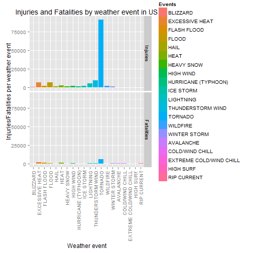
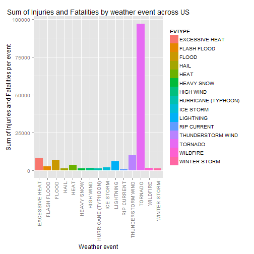
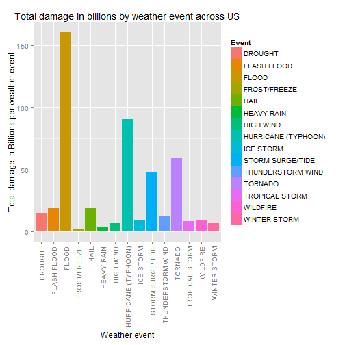

# Adverse Impact of Severe Weather Events on Public Health and Economy Between 1950 and 2011


```r
data <- read.csv("C:\\Users\\Razib\\Desktop\\Reproducible Research\\2\\StormData\\StormData.csv", sep=",",quote="\"", na.strings = "NA")
dim(data)
```

```
## [1] 902297     37
```

```r
head(data)
```

```
##   STATE__           BGN_DATE BGN_TIME TIME_ZONE COUNTY COUNTYNAME STATE
## 1       1  4/18/1950 0:00:00     0130       CST     97     MOBILE    AL
## 2       1  4/18/1950 0:00:00     0145       CST      3    BALDWIN    AL
## 3       1  2/20/1951 0:00:00     1600       CST     57    FAYETTE    AL
## 4       1   6/8/1951 0:00:00     0900       CST     89    MADISON    AL
## 5       1 11/15/1951 0:00:00     1500       CST     43    CULLMAN    AL
## 6       1 11/15/1951 0:00:00     2000       CST     77 LAUDERDALE    AL
##    EVTYPE BGN_RANGE BGN_AZI BGN_LOCATI END_DATE END_TIME COUNTY_END
## 1 TORNADO         0                                               0
## 2 TORNADO         0                                               0
## 3 TORNADO         0                                               0
## 4 TORNADO         0                                               0
## 5 TORNADO         0                                               0
## 6 TORNADO         0                                               0
##   COUNTYENDN END_RANGE END_AZI END_LOCATI LENGTH WIDTH F MAG FATALITIES
## 1         NA         0                      14.0   100 3   0          0
## 2         NA         0                       2.0   150 2   0          0
## 3         NA         0                       0.1   123 2   0          0
## 4         NA         0                       0.0   100 2   0          0
## 5         NA         0                       0.0   150 2   0          0
## 6         NA         0                       1.5   177 2   0          0
##   INJURIES PROPDMG PROPDMGEXP CROPDMG CROPDMGEXP WFO STATEOFFIC ZONENAMES
## 1       15    25.0          K       0                                    
## 2        0     2.5          K       0                                    
## 3        2    25.0          K       0                                    
## 4        2     2.5          K       0                                    
## 5        2     2.5          K       0                                    
## 6        6     2.5          K       0                                    
##   LATITUDE LONGITUDE LATITUDE_E LONGITUDE_ REMARKS REFNUM
## 1     3040      8812       3051       8806              1
## 2     3042      8755          0          0              2
## 3     3340      8742          0          0              3
## 4     3458      8626          0          0              4
## 5     3412      8642          0          0              5
## 6     3450      8748          0          0              6
```

```r
str(data)
```

```
## 'data.frame':	902297 obs. of  37 variables:
##  $ STATE__   : num  1 1 1 1 1 1 1 1 1 1 ...
##  $ BGN_DATE  : Factor w/ 16335 levels "1/1/1966 0:00:00",..: 6523 6523 4242 11116 2224 2224 2260 383 3980 3980 ...
##  $ BGN_TIME  : Factor w/ 3608 levels "00:00:00 AM",..: 272 287 2705 1683 2584 3186 242 1683 3186 3186 ...
##  $ TIME_ZONE : Factor w/ 22 levels "ADT","AKS","AST",..: 7 7 7 7 7 7 7 7 7 7 ...
##  $ COUNTY    : num  97 3 57 89 43 77 9 123 125 57 ...
##  $ COUNTYNAME: Factor w/ 29601 levels "","5NM E OF MACKINAC BRIDGE TO PRESQUE ISLE LT MI",..: 13513 1873 4598 10592 4372 10094 1973 23873 24418 4598 ...
##  $ STATE     : Factor w/ 72 levels "AK","AL","AM",..: 2 2 2 2 2 2 2 2 2 2 ...
##  $ EVTYPE    : Factor w/ 985 levels "   HIGH SURF ADVISORY",..: 834 834 834 834 834 834 834 834 834 834 ...
##  $ BGN_RANGE : num  0 0 0 0 0 0 0 0 0 0 ...
##  $ BGN_AZI   : Factor w/ 35 levels "","  N"," NW",..: 1 1 1 1 1 1 1 1 1 1 ...
##  $ BGN_LOCATI: Factor w/ 54429 levels "","- 1 N Albion",..: 1 1 1 1 1 1 1 1 1 1 ...
##  $ END_DATE  : Factor w/ 6663 levels "","1/1/1993 0:00:00",..: 1 1 1 1 1 1 1 1 1 1 ...
##  $ END_TIME  : Factor w/ 3647 levels ""," 0900CST",..: 1 1 1 1 1 1 1 1 1 1 ...
##  $ COUNTY_END: num  0 0 0 0 0 0 0 0 0 0 ...
##  $ COUNTYENDN: logi  NA NA NA NA NA NA ...
##  $ END_RANGE : num  0 0 0 0 0 0 0 0 0 0 ...
##  $ END_AZI   : Factor w/ 24 levels "","E","ENE","ESE",..: 1 1 1 1 1 1 1 1 1 1 ...
##  $ END_LOCATI: Factor w/ 34506 levels "","- .5 NNW",..: 1 1 1 1 1 1 1 1 1 1 ...
##  $ LENGTH    : num  14 2 0.1 0 0 1.5 1.5 0 3.3 2.3 ...
##  $ WIDTH     : num  100 150 123 100 150 177 33 33 100 100 ...
##  $ F         : int  3 2 2 2 2 2 2 1 3 3 ...
##  $ MAG       : num  0 0 0 0 0 0 0 0 0 0 ...
##  $ FATALITIES: num  0 0 0 0 0 0 0 0 1 0 ...
##  $ INJURIES  : num  15 0 2 2 2 6 1 0 14 0 ...
##  $ PROPDMG   : num  25 2.5 25 2.5 2.5 2.5 2.5 2.5 25 25 ...
##  $ PROPDMGEXP: Factor w/ 19 levels "","-","?","+",..: 17 17 17 17 17 17 17 17 17 17 ...
##  $ CROPDMG   : num  0 0 0 0 0 0 0 0 0 0 ...
##  $ CROPDMGEXP: Factor w/ 9 levels "","?","0","2",..: 1 1 1 1 1 1 1 1 1 1 ...
##  $ WFO       : Factor w/ 542 levels ""," CI","$AC",..: 1 1 1 1 1 1 1 1 1 1 ...
##  $ STATEOFFIC: Factor w/ 250 levels "","ALABAMA, Central",..: 1 1 1 1 1 1 1 1 1 1 ...
##  $ ZONENAMES : Factor w/ 25112 levels "","                                                                                                                               "| __truncated__,..: 1 1 1 1 1 1 1 1 1 1 ...
##  $ LATITUDE  : num  3040 3042 3340 3458 3412 ...
##  $ LONGITUDE : num  8812 8755 8742 8626 8642 ...
##  $ LATITUDE_E: num  3051 0 0 0 0 ...
##  $ LONGITUDE_: num  8806 0 0 0 0 ...
##  $ REMARKS   : Factor w/ 436774 levels "","-2 at Deer Park\n",..: 1 1 1 1 1 1 1 1 1 1 ...
##  $ REFNUM    : num  1 2 3 4 5 6 7 8 9 10 ...
```

```r
colnames(data)
```

```
##  [1] "STATE__"    "BGN_DATE"   "BGN_TIME"   "TIME_ZONE"  "COUNTY"    
##  [6] "COUNTYNAME" "STATE"      "EVTYPE"     "BGN_RANGE"  "BGN_AZI"   
## [11] "BGN_LOCATI" "END_DATE"   "END_TIME"   "COUNTY_END" "COUNTYENDN"
## [16] "END_RANGE"  "END_AZI"    "END_LOCATI" "LENGTH"     "WIDTH"     
## [21] "F"          "MAG"        "FATALITIES" "INJURIES"   "PROPDMG"   
## [26] "PROPDMGEXP" "CROPDMG"    "CROPDMGEXP" "WFO"        "STATEOFFIC"
## [31] "ZONENAMES"  "LATITUDE"   "LONGITUDE"  "LATITUDE_E" "LONGITUDE_"
## [36] "REMARKS"    "REFNUM"
```

```r
## Subset data
subData <- data[, c("STATE", "EVTYPE", "FATALITIES", "INJURIES", 
               "PROPDMG", "PROPDMGEXP", "CROPDMG", "CROPDMGEXP")]
head(subData)
```

```
##   STATE  EVTYPE FATALITIES INJURIES PROPDMG PROPDMGEXP CROPDMG CROPDMGEXP
## 1    AL TORNADO          0       15    25.0          K       0           
## 2    AL TORNADO          0        0     2.5          K       0           
## 3    AL TORNADO          0        2    25.0          K       0           
## 4    AL TORNADO          0        2     2.5          K       0           
## 5    AL TORNADO          0        2     2.5          K       0           
## 6    AL TORNADO          0        6     2.5          K       0
```

Remove inconsequential values

```r
## Check to see if there are rows that have value for all four columns
## FATALITIES and INJURIES and PROPDMG and CROPDMG is zero
ignore <- subData[which(subData$FATALITIES == 0 & subData$INJURIES == 0 &
                         subData$PROPDMG == 0 & subData$CROPDMG == 0), ]
## Ignore these rows that have values for all four columns to be zero because
## for the purpose of this analysis, these rows are inconsequential for their
## corresponding event types as they did not lead to any damage health or
## property.  So, select all rows that have non-zero value for at least one of
## these four columns.
myData <- subData[which(subData$FATALITIES > 0 | subData$INJURIES > 0 |
                         subData$PROPDMG > 0 | subData$CROPDMG > 0), ]
```

Clean event types according to specification in document.

Here we are looking to clean events that can be categrorized as TORNADO.

```r
tornado <- myData[grepl("torn", myData$EVTYPE, ignore.case = TRUE),]
#Check to see if there are any event types to be cleaned
chktornado <- myData[grepl("torn", myData$EVTYPE, ignore.case = TRUE) & 
                             !grepl("tornado", 
                                    myData$EVTYPE, ignore.case = TRUE),]
## There is one event type where TORNADO  is misspelled as TORNDAO.  Clean in
## by substituting with correct spelling
myData[grepl("TORNDAO", 
             myData$EVTYPE, ignore.case = TRUE), "EVTYPE"] <- "TORNADO"
myData[grepl("TORNTORNDAO", 
             myData$EVTYPE, ignore.case = TRUE), "EVTYPE"] <- "TORNADO"
## Clean observations as:
## TORNADOES, TSTM WIND, HAIL -> TORNADO,
## TORNADOES -> TORNADO
myData[grepl("tornadoes", 
             myData$EVTYPE, ignore.case = TRUE), "EVTYPE"] <- "TORNADO"
myData[grepl("COLD AIR TORNADO", 
             myData$EVTYPE, ignore.case = TRUE), "EVTYPE"] <- "TORNADO"
myData[grepl("TORNADO F", 
             myData$EVTYPE, ignore.case = TRUE), "EVTYPE"] <- "TORNADO"
```

Categorize Avalance related events.

```r
avl <- myData[grepl("aval", myData$EVTYPE, ignore.case = TRUE) &
                      !grepl("Avalanche", myData$EVTYPE, ignore.case = TRUE),]
## One entry where Avalanche is mispelled as Avalance.  Clean it up by 
## replacing with correct spelling.
myData$EVTYPE <- sub("AVALANCE", "AVALANCHE", myData$EVTYPE)
```

Categorize BLIZZARD related events.

```r
## Explore blizzard related data
bl <- myData[grepl("bli", myData$EVTYPE, ignore.case = TRUE), ]
blz <- myData[grepl("bli", myData$EVTYPE, ignore.case = TRUE) &
                      !grepl("Blizzard", myData$EVTYPE, ignore.case = TRUE),]
myData[grepl("BLIZZARD/WINTER STORM", myData$EVTYPE, 
             ignore.case = TRUE), "EVTYPE"] <- "BLIZZARD"
myData[grepl("GROUND BLIZZARD", myData$EVTYPE, 
             ignore.case = TRUE), "EVTYPE"] <- "BLIZZARD"
## All rows for blizzard are already correct.  No cleaning needed.
```

Check and clean COASTAL FLOOD related events.

```r
cf <- myData[grepl("^coastal flood", myData$EVTYPE, ignore.case = TRUE), ]
## All rows for Coastal flood are spelled correct.  But there are some rows
## that contain Coastal flooding and some rows have coastal flood/erosion instead
## of Coastal Flood that is specified in the in documentaion.  Clean it so that
## all these event types comply to the accompanying code book and so have value
## Coastal flood
myData$EVTYPE <- sub("coastal flooding", "Coastal Flood", myData$EVTYPE,
                     ignore.case = TRUE)
myData$EVTYPE <- sub("coastal flooding/erosion", "Coastal Flood", myData$EVTYPE,
                     ignore.case = TRUE)
myData$EVTYPE <- sub("coastal flood/erosion", "Coastal Flood", myData$EVTYPE,
                     ignore.case = TRUE)
```

Work on events related to COLD/WIND CHILL.

```r
cwc <- myData[grepl("^cold/", myData$EVTYPE, ignore.case = TRUE), ]
myData$EVTYPE <- sub("^cold/winds", "COLD/WIND CHILL", myData$EVTYPE, 
                     ignore.case = TRUE)
uev <- unique(myData$EVTYPE)
ucld <- uev[grepl("cold", uev, ignore.case = TRUE)]
myData[grepl("cold", myData$EVTYPE, 
                    ignore.case = TRUE) &
               !grepl("COLD/WIND CHILL", myData$EVTYPE, 
                    ignore.case = TRUE) &
               !grepl("EXTREME COLD/WIND CHILL", myData$EVTYPE, 
                    ignore.case = TRUE), "EVTYPE"] <- "COLD/WIND CHILL"
```
Check and clean events related to DEBRIS FLOW.

```r
deb <- myData[grepl("^deb", myData$EVTYPE, ignore.case = TRUE), ]
## No rows for Debris flow
```
Work on events related to DENSE FOG.

```r
dfg <- myData[grepl("^dens", myData$EVTYPE, ignore.case = TRUE), ]
chkdfg <- myData[grepl("^dens", myData$EVTYPE, ignore.case = TRUE) &
                         !grepl("^dense fog", myData$EVTYPE, 
                                ignore.case = TRUE), ]
```
Work on evens related to DROUGHT.

```r
drt <- myData[grepl("drou", myData$EVTYPE, ignore.case = TRUE), ]
myData$EVTYPE <- sub("DROUGHT/EXCESSIVE HEAT", "DROUGHT", myData$EVTYPE, 
                     ignore.case = TRUE)
drtcln <- myData[grepl("drou", myData$EVTYPE, ignore.case = TRUE) &
                         !grepl("^drou", myData$EVTYPE, ignore.case = TRUE), ]
myData$EVTYPE <- sub("HEAT WAVE DROUGHT", "DROUGHT", myData$EVTYPE, 
                     ignore.case = TRUE)
```
Work on events related to DUST DEVIL.

```r
dd <- myData[grepl("dust devil", myData$EVTYPE, ignore.case = TRUE), ]
myData$EVTYPE <- sub("DUST DEVIL WATERSPOUT", "DUST DEVIL", 
                     myData$EVTYPE, ignore.case = TRUE)
ddchk <- myData[grepl("dust devil", myData$EVTYPE, ignore.case = TRUE) &
                     !grepl("^dust", myData$EVTYPE, ignore.case = TRUE) , ]
```
Work on events related to DUST STORM.

```r
ds <- myData[grepl("dust storm", myData$EVTYPE, ignore.case = TRUE), ]
dschk <- myData[grepl("dust", myData$EVTYPE, ignore.case = TRUE) &
                        !grepl("^dust", myData$EVTYPE, ignore.case = TRUE), ]
myData$EVTYPE <- sub("BLOWING DUST", "DUST STORM", 
                     myData$EVTYPE, ignore.case = TRUE)
myData$EVTYPE <- sub("DUST STORM/HIGH WINDS", "DUST STORM", 
                     myData$EVTYPE, ignore.case = TRUE)
```
Work on events related to EXCESSIVE HEAT.

```r
eh <- myData[grepl("excessive heat", myData$EVTYPE, ignore.case = TRUE), ]

ehchk <- myData[grepl("excessive heat", myData$EVTYPE, ignore.case = TRUE) &
                         !grepl("^excessive heat", myData$EVTYPE, 
                                ignore.case = TRUE), ]
myData$EVTYPE <- sub("RECORD/EXCESSIVE HEAT", "EXCESSIVE HEAT", 
                     myData$EVTYPE, ignore.case = TRUE)
ehp <- myData[grepl("excessive heat", myData$EVTYPE, ignore.case = TRUE) &
                      !grepl("^excessive heat", myData$EVTYPE, 
                                ignore.case = TRUE), ]
```
Work on events related to EXTREME COLD/WIND CHILL.

```r
ec <- myData[grepl("extr", myData$EVTYPE, ignore.case = TRUE), ]

echks <- myData[grepl("extre", myData$EVTYPE, ignore.case = TRUE) &
                         !grepl("^extre", myData$EVTYPE, ignore.case = TRUE), ]

echk <- myData[grepl("extre", myData$EVTYPE, ignore.case = TRUE) &
                         !grepl("extreme cold", myData$EVTYPE, 
                                ignore.case = TRUE), ]
myData$EVTYPE <- sub("EXTREME WIND CHILL", "EXTREME COLD/WIND CHILL", 
                     myData$EVTYPE, ignore.case = TRUE)
myData$EVTYPE <- sub("EXTREME WINDCHILL", "EXTREME COLD/WIND CHILL", 
                     myData$EVTYPE, ignore.case = TRUE)
myData[grepl("EXTREME COLD", myData$EVTYPE, ignore.case = TRUE),
       "EVTYPE"] <- "EXTREME COLD/WIND CHILL"
```
Work on events related FLASH FLOOD.

```r
fl <- myData[grepl("flash", myData$EVTYPE, ignore.case = TRUE), ]
myData$EVTYPE <- sub("FLASH FLOODING", "FLASH FLOOD", 
                     myData$EVTYPE, ignore.case = TRUE)
ffp <- myData[grepl("flash", myData$EVTYPE, ignore.case = TRUE), ]
ffchk <- myData[grepl("flash", myData$EVTYPE, ignore.case = TRUE) &
                         !grepl("^flash", myData$EVTYPE, 
                                ignore.case = TRUE), ]
uev <- unique(myData$EVTYPE)
flfl <- uev[grepl("flash", uev, ignore.case = TRUE)]
myData[grepl("ICE STORM/FLASH FLOOD", myData$EVTYPE, 
                    ignore.case = TRUE), "EVTYPE"] <- "ICE STORM"
myData[grepl("FLASH FLOOD WINDS", myData$EVTYPE, 
                    ignore.case = TRUE), "EVTYPE"] <- "FLASH FLOOD"
myData[grepl("FLASH FLOOD/", myData$EVTYPE, 
                    ignore.case = TRUE), "EVTYPE"] <- "FLASH FLOOD"
myData[grepl("FLASH FLOODS", myData$EVTYPE, 
                    ignore.case = TRUE), "EVTYPE"] <- "FLASH FLOOD"
myData[grepl("URBAN AND FLASH FLOODIN", myData$EVTYPE, 
                    ignore.case = TRUE), "EVTYPE"] <- "FLASH FLOOD"
myData[grepl("MUD SLIDES FLASH FLOOD", myData$EVTYPE, 
                    ignore.case = TRUE), "EVTYPE"] <- "FLASH FLOOD"
myData[grepl("FLASH FLOOD FROM ICE JAMS", myData$EVTYPE, 
                    ignore.case = TRUE), "EVTYPE"] <- "FLASH FLOOD"
myData[grepl("FLASH FLOOD - HEAVY RAIN", myData$EVTYPE, 
                    ignore.case = TRUE), "EVTYPE"] <- "FLASH FLOOD"
myData[grepl("FLOOD FLASH", myData$EVTYPE, 
                    ignore.case = TRUE), "EVTYPE"] <- "FLASH FLOOD"
myData[grepl("FLOOD/FLASH", myData$EVTYPE, 
                    ignore.case = TRUE), "EVTYPE"] <- "FLASH FLOOD"
myData[grepl("FLASH FLOOD LANDSLIDES", myData$EVTYPE, 
                    ignore.case = TRUE), "EVTYPE"] <- "FLASH FLOOD"
myData[grepl("FLASH FLOOD \\(MINOR", myData$EVTYPE, 
                    ignore.case = TRUE), "EVTYPE"] <- "FLASH FLOOD"
myData[grepl(" FLASH FLOOD", myData$EVTYPE, 
                    ignore.case = TRUE), "EVTYPE"] <- "FLASH FLOOD"
myData[grepl("URBAN AND FLASH FLOODIN", myData$EVTYPE, 
                    ignore.case = TRUE), "EVTYPE"] <- "FLASH FLOOD"
```
Work on events related to FLOOD.

```r
fld <- myData[grepl("^flood", myData$EVTYPE, ignore.case = TRUE), ]
myData$EVTYPE <- sub("FLOODING", "FLOOD", myData$EVTYPE, ignore.case = TRUE)
myData$EVTYPE <- sub("FLOOD/FLASH FLOOD", "FLOOD", 
                     myData$EVTYPE, ignore.case = TRUE)
fldp <- myData[grepl("flood", myData$EVTYPE, ignore.case = TRUE) &
                       !grepl("^flood", myData$EVTYPE, ignore.case = TRUE) &
                       !grepl("flash flood", myData$EVTYPE, ignore.case = TRUE) &
                       !grepl("coastal flood", myData$EVTYPE, 
                              ignore.case = TRUE) &
                       !grepl("lakeshore flood", myData$EVTYPE, 
                              ignore.case = TRUE), ]
myData$EVTYPE <- sub("RIVER FLOOD", "FLOOD", myData$EVTYPE, ignore.case = TRUE)
myData$EVTYPE <- sub("BREAKUP FLOOD", "FLOOD", myData$EVTYPE, ignore.case = TRUE)
myData$EVTYPE <- sub("URBAN FLOOD", "FLASH FLOOD", myData$EVTYPE, 
                     ignore.case = TRUE)
myData$EVTYPE <- sub("URBAN/SMALL STREAM FLOOD", "FLASH FLOOD", myData$EVTYPE, 
                     ignore.case = TRUE)
myData$EVTYPE <- sub("MAJOR FLOOD", "FLOOD", myData$EVTYPE, ignore.case = TRUE)
myData$EVTYPE <- sub("MINOR FLOOD", "FLOOD", myData$EVTYPE, ignore.case = TRUE)
myData$EVTYPE <- sub("RURAL FLOOD", "FLOOD", myData$EVTYPE, ignore.case = TRUE)
myData$EVTYPE <- sub("ICE JAM FLOOD", "FLASH FLOOD", myData$EVTYPE, 
                     ignore.case = TRUE)
myData$EVTYPE <- sub("SMALL STREAM FLOOD", "FLASH FLOOD", myData$EVTYPE, 
                     ignore.case = TRUE)
myData$EVTYPE <- sub("LAKE FLOOD", "LAKESHORE FLOOD", myData$EVTYPE, 
                     ignore.case = TRUE)
myData$EVTYPE <- sub("URBAN AND SMALL STREAM FLOODIN", "FLASH FLOOD", 
                     myData$EVTYPE, ignore.case = TRUE)
myData$EVTYPE <- sub("RIVER AND STREAM FLOOD", "FLASH FLOOD", 
                     myData$EVTYPE, ignore.case = TRUE)
myData$EVTYPE <- sub("SNOWMELT FLOOD", "FLASH FLOOD", 
                     myData$EVTYPE, ignore.case = TRUE)
myData$EVTYPE <- sub("HEAVY SNOW/HIGH WINDS & FLOOD", "HEAVY SNOW", 
                     myData$EVTYPE, ignore.case = TRUE)
myData$EVTYPE <- sub("HEAVY RAIN AND FLOOD", "HEAVY RAIN", 
                     myData$EVTYPE, ignore.case = TRUE)
myData$EVTYPE <- sub("HEAVY RAINS/FLOOD", "HEAVY RAIN", 
                     myData$EVTYPE, ignore.case = TRUE)
myData$EVTYPE <- sub("THUNDERSTORM WINDS/FLOOD", "THUNDERSTORM WIND", 
                     myData$EVTYPE, ignore.case = TRUE)
myData$EVTYPE <- sub("Erosion/Cstl Flood", "COASTAL FLOOD", 
                     myData$EVTYPE, ignore.case = TRUE)
myData$EVTYPE <- sub("COASTAL  FLOOD/EROSION", "COASTAL FLOOD", 
                     myData$EVTYPE, ignore.case = TRUE)
myData$EVTYPE <- sub("TIDAL FLOOD", "FLOOD", 
                     myData$EVTYPE, ignore.case = TRUE)
myData$EVTYPE <- sub("THUNDERSTORM WINDS/ FLOOD", "THUNDERSTORM WIND", 
                     myData$EVTYPE, ignore.case = TRUE)
myData$EVTYPE <- sub("FLASH FLOOD/THUNDERSTORM WI", "FLASH FLOOD", 
                     myData$EVTYPE, ignore.case = TRUE)
myData$EVTYPE <- sub("FLOODS", "FLOOD", 
                     myData$EVTYPE, ignore.case = TRUE)
myData$EVTYPE <- sub("FLOOD/FLOOD", "FLOOD", 
                     myData$EVTYPE, ignore.case = TRUE)

fldps <- myData[grepl("flood", myData$EVTYPE, ignore.case = TRUE) &
                       !grepl("^flood", myData$EVTYPE, ignore.case = TRUE) &
                       !grepl("flash flood", myData$EVTYPE, ignore.case = TRUE) &
                       !grepl("coastal flood", myData$EVTYPE, 
                              ignore.case = TRUE) &
                       !grepl("lakeshore flood", myData$EVTYPE, 
                              ignore.case = TRUE), ]
```
Check and clean events related to THUDERSTORM WIND.

```r
ts <- myData[grepl("^thun", myData$EVTYPE, ignore.case = TRUE), ]
myData[grepl("^thun", myData$EVTYPE, 
                    ignore.case = TRUE), "EVTYPE"] <- "THUNDERSTORM WIND"
tschk <- myData[grepl("^thun", myData$EVTYPE, ignore.case = TRUE) &
                        grepl("thunderstorm winds", myData$EVTYPE, 
                              ignore.case = TRUE), ]

tsb <- myData[grepl("thun", myData$EVTYPE, ignore.case = TRUE) &
                     !grepl("^thun", myData$EVTYPE, ignore.case = TRUE), ]

myData[grepl("severe thun", myData$EVTYPE, 
                    ignore.case = TRUE), "EVTYPE"] <- "THUNDERSTORM WIND"
tsbchk <- myData[grepl("thun", myData$EVTYPE, ignore.case = TRUE) &
                     !grepl("^thun", myData$EVTYPE, ignore.case = TRUE), ]
myData[grepl("LIGHTNING THUNDERSTORM WINDS", myData$EVTYPE, 
                    ignore.case = TRUE), "EVTYPE"] <- "THUNDERSTORM WIND"
myData[grepl("LIGHTNING AND THUNDERSTORM WIN", myData$EVTYPE, 
                    ignore.case = TRUE), "EVTYPE"] <- "THUNDERSTORM WIND"
myData[grepl("TUNDERSTORM WIND", myData$EVTYPE, 
                    ignore.case = TRUE), "EVTYPE"] <- "THUNDERSTORM WIND"
myData[grepl("THUDERSTORM WINDS", myData$EVTYPE, 
                    ignore.case = TRUE), "EVTYPE"] <- "THUNDERSTORM WIND"
myData[grepl("^tstm", myData$EVTYPE, 
                    ignore.case = TRUE), "EVTYPE"] <- "THUNDERSTORM WIND"
tstm <- myData[grepl("TSTM", myData$EVTYPE, ignore.case = TRUE), ]
myData[grepl("MARINE TSTM WIND", myData$EVTYPE, 
                    ignore.case = TRUE), "EVTYPE"] <- "MARINE THUNDERSTORM WIND"
myData[grepl("NON-TSTM WIND", myData$EVTYPE, 
                    ignore.case = TRUE), "EVTYPE"] <- "HIGH WIND"
myData[grepl("TSTM WIND", myData$EVTYPE, 
                    ignore.case = TRUE), "EVTYPE"] <- "THUNDERSTORM WIND"
tstmchk <- myData[grepl("TSTM", myData$EVTYPE, ignore.case = TRUE), ]
```
Work on events related to FROST/FREEZE.

```r
uev <- unique(myData$EVTYPE)
frst <- uev[grepl("frost", uev, ignore.case = TRUE)]

myData[grepl("frost", myData$EVTYPE, 
                    ignore.case = TRUE), "EVTYPE"] <- "FROST/FREEZE"
myData[grepl("freeze", myData$EVTYPE, 
                    ignore.case = TRUE) &
               !grepl("FROST/FREEZE", myData$EVTYPE, 
                    ignore.case = TRUE), "EVTYPE"] <- "FROST/FREEZE"
```
Work on events related to HAIL.

```r
uev <- unique(myData$EVTYPE)
hl <- uev[grepl("hail", uev, ignore.case = TRUE)]
myData[grepl("^hail", myData$EVTYPE, 
                    ignore.case = TRUE), "EVTYPE"] <- "HAIL"
myData[grepl("WIND/HAIL", myData$EVTYPE, 
                    ignore.case = TRUE), "EVTYPE"] <- "HAIL"
myData[grepl("SMALL HAIL", myData$EVTYPE, 
                    ignore.case = TRUE), "EVTYPE"] <- "HAIL"
myData[grepl("GUSTY WIND/HAIL", myData$EVTYPE, 
                    ignore.case = TRUE), "EVTYPE"] <- "HAIL"
```
Work on events related to HEAT.

```r
uev <- unique(myData$EVTYPE)
ht <- uev[grepl("heat", uev, ignore.case = TRUE)]
myData[grepl("heat", myData$EVTYPE, 
                    ignore.case = TRUE) &
               !grepl("excessive heat", myData$EVTYPE, 
                    ignore.case = TRUE), "EVTYPE"] <- "HEAT"
```
Work on events related to HEAVY RAIN.

```r
uev <- unique(myData$EVTYPE)
hvrn <- uev[grepl("rain", uev, ignore.case = TRUE)]
myData[grepl("rain", myData$EVTYPE, 
                    ignore.case = TRUE), "EVTYPE"] <- "HEAVY RAIN"
```
Work on events related to HEAVY SNOW.

```r
uev <- unique(myData$EVTYPE)
hvsn <- uev[grepl("snow", uev, ignore.case = TRUE)]

myData[grepl("snow", myData$EVTYPE, 
                    ignore.case = TRUE) &
               !grepl("lake", myData$EVTYPE, 
                    ignore.case = TRUE), "EVTYPE"] <- "HEAVY SNOW"
```
Work on events related to LAKE-EFFECT SNOW.

```r
uev <- unique(myData$EVTYPE)
lksn <- uev[grepl("lake", uev, ignore.case = TRUE)]
## HEAVY LAKE SNOW -> LAKE-EFFECT SNOW,  Lake Effect Snow -> LAKE-EFFECT SNOW 
myData[grepl("HEAVY LAKE SNOW", myData$EVTYPE, 
                    ignore.case = TRUE), "EVTYPE"] <- "LAKE-EFFECT SNOW"
myData[grepl("Lake Effect Snow", myData$EVTYPE, 
                    ignore.case = TRUE), "EVTYPE"] <- "LAKE-EFFECT SNOW"
```
Work on events related to HIGH SURF.

```r
uev <- unique(myData$EVTYPE)
hsrf <- uev[grepl("tide", uev, ignore.case = TRUE)]
myData[grepl("surf", myData$EVTYPE, 
                    ignore.case = TRUE), "EVTYPE"] <- "HIGH SURF"
```
Work on events related to HIGH WIND.

```r
uev <- unique(myData$EVTYPE)
wnd <- uev[grepl("wind", uev, ignore.case = TRUE)]
uev <- unique(myData$EVTYPE)
clnwnd <- uev[grepl("wind", uev, ignore.case = TRUE) &
                   !grepl("HURRICANE OPAL", uev, ignore.case = TRUE) &
                   !grepl("MARINE", uev, ignore.case = TRUE) &
                   !grepl("WINTER STORM", uev, ignore.case = TRUE) &
                   !grepl("Cold/Wind Chill", uev, ignore.case = TRUE) &
                   !grepl("Extreme Cold/Wind Chill", uev, ignore.case = TRUE) &
                   !grepl("Strong wind", uev, ignore.case = TRUE) &
                   !grepl("Thunderstorm Wind", uev, ignore.case = TRUE) &
                   !grepl("gusty wind", uev, ignore.case = TRUE)]
myData[grepl("wind", myData$EVTYPE, 
                    ignore.case = TRUE) &
               !grepl("HURRICANE OPAL", myData$EVTYPE, 
                    ignore.case = TRUE) &
               !grepl("MARINE", myData$EVTYPE, 
                    ignore.case = TRUE) &
               !grepl("WINTER STORM", myData$EVTYPE, 
                    ignore.case = TRUE) &
               !grepl("Cold/Wind Chill", myData$EVTYPE, 
                      ignore.case = TRUE) &
               !grepl("Extreme Cold/Wind Chill", myData$EVTYPE, 
                      ignore.case = TRUE) &
               !grepl("Strong wind", myData$EVTYPE, 
                      ignore.case = TRUE) &
               !grepl("Thunderstorm Wind", myData$EVTYPE, 
                      ignore.case = TRUE) &
               !grepl("gusty wind", myData$EVTYPE, 
                      ignore.case = TRUE), "EVTYPE"] <- "HIGH WIND"
```
Work on events related to HURRICANE (TYPHOON)

```r
uev <- unique(myData$EVTYPE)
hrcn <- uev[grepl("hur", uev, ignore.case = TRUE)]
myData[grepl("hur", myData$EVTYPE, 
                    ignore.case = TRUE), "EVTYPE"] <- "HURRICANE (TYPHOON)"
myData[grepl("TYPHOON", myData$EVTYPE, 
                    ignore.case = TRUE), "EVTYPE"] <- "HURRICANE (TYPHOON)"
```
Work on events related to ICE STORM.

```r
uev <- unique(myData$EVTYPE)
icst <- uev[grepl("ice", uev, ignore.case = TRUE)]
myData[grepl("ice", myData$EVTYPE, 
                    ignore.case = TRUE), "EVTYPE"] <- "ICE STORM"
```
Work on events related to LIGHTNING.

```r
uev <- unique(myData$EVTYPE)
ltng <- uev[grepl("light", uev, ignore.case = TRUE)]
myData[grepl("light", myData$EVTYPE, 
                    ignore.case = TRUE), "EVTYPE"] <- "LIGHTNING"
myData[grepl("LIGNTNING", myData$EVTYPE, 
                    ignore.case = TRUE), "EVTYPE"] <- "LIGHTNING"
```
Work on events related to MARINE HIGH WIND.

```r
uev <- unique(myData$EVTYPE)
mrn <- uev[grepl("marine", uev, ignore.case = TRUE)]
myData[grepl("Marine Accident", myData$EVTYPE, 
                    ignore.case = TRUE), "EVTYPE"] <- "MARINE HIGH WIND"
myData[grepl("MARINE MISHAP", myData$EVTYPE, 
                    ignore.case = TRUE), "EVTYPE"] <- "MARINE HIGH WIND"
```
Work on events related to RIP CURRENT.

```r
uev <- unique(myData$EVTYPE)
rpcr <- uev[grepl("rip", uev, ignore.case = TRUE)]
## Values RIP CURRENTS of EVTYPE to be changed to RIP CURRENT.  
myData[grepl("RIP CURRENTS", myData$EVTYPE, 
                    ignore.case = TRUE), "EVTYPE"] <- "RIP CURRENT"
```
Work on events related to STORM SURGE/TIDE.

```r
uev <- unique(myData$EVTYPE)
stsg <- uev[grepl("Surge", uev, ignore.case = TRUE)]
## Two Values STORM SURGE and "COASTAL SURGE of EVTYPE need to be made compliant  
myData[grepl("STORM SURGE", myData$EVTYPE, 
                    ignore.case = TRUE), "EVTYPE"] <- "STORM SURGE/TIDE"
myData[grepl("COASTAL SURGE", myData$EVTYPE, 
                    ignore.case = TRUE), "EVTYPE"] <- "STORM SURGE/TIDE"
```
Work on events related to STRONG WIND.

```r
uev <- unique(myData$EVTYPE)
stwnd <- uev[grepl("Strong", uev, ignore.case = TRUE)]

myData[grepl("Strong winds", myData$EVTYPE, 
                    ignore.case = TRUE), "EVTYPE"] <- "STRONG WIND"
uev <- unique(myData$EVTYPE)
gswnd <- uev[grepl("gusty", uev, ignore.case = TRUE)]

myData[grepl("gusty", myData$EVTYPE, 
                    ignore.case = TRUE), "EVTYPE"] <- "STRONG WIND"
```
Work on events related to TROPICAL STORM.

```r
uev <- unique(myData$EVTYPE)
trst <- uev[grepl("trop", uev, ignore.case = TRUE)]


myData[grepl("trop", myData$EVTYPE, ignore.case = TRUE) &
               !grepl("tropical depression", myData$EVTYPE, 
                      ignore.case = TRUE), "EVTYPE"] <- "TROPICAL STORM"
```
Work on events related to WATERSPOUT.

```r
uev <- unique(myData$EVTYPE)
ws <- uev[grepl("water", uev, ignore.case = TRUE)]


myData[grepl("water", myData$EVTYPE, 
             ignore.case = TRUE), "EVTYPE"] <- "WATERSPOUT"
```
Work on events related to WILDFIRE.

```r
uev <- unique(myData$EVTYPE)
wf <- uev[grepl("wild", uev, ignore.case = TRUE)]


myData[grepl("wild", myData$EVTYPE, 
             ignore.case = TRUE), "EVTYPE"] <- "WILDFIRE"
```
Work on events related to WINTER WEATHER.

```r
uev <- unique(myData$EVTYPE)
wth <- uev[grepl("weather", uev, ignore.case = TRUE)]
myData[grepl("WARM WEATHER", myData$EVTYPE, 
             ignore.case = TRUE), "EVTYPE"] <- "HEAT"
myData[grepl("WEATHER", myData$EVTYPE, 
             ignore.case = TRUE), "EVTYPE"] <- "WINTER WEATHER"
```
Work on events related to WINTER STORM.

```r
uev <- unique(myData$EVTYPE)
wtst <- uev[grepl("winter", uev, ignore.case = TRUE)]
myData[grepl("winter", myData$EVTYPE, 
             ignore.case = TRUE) &
               !grepl("winter weather", myData$EVTYPE, 
                      ignore.case = TRUE), "EVTYPE"] <- "WINTER STORM"
```
Rest of the values were taken care of while working on events specified above.

Convert all events to be in upper case for consistency.

```r
myData$EVTYPE <- toupper(myData$EVTYPE)
```

## Results


```r
library(ggplot2)

inj <- myData[,c("EVTYPE", "INJURIES")]

eventinj <- aggregate(INJURIES ~ EVTYPE, data=inj, FUN=sum)

eventinj <- eventinj[order(eventinj$INJURIES, decreasing = TRUE),]

eventinj <- eventinj[1:15, ]

ftlts <- myData[,c("EVTYPE", "FATALITIES")]

eventftl <- aggregate(FATALITIES ~ EVTYPE, data=ftlts, FUN=sum)
eventftl <- eventftl[order(eventftl$FATALITIES, decreasing = TRUE),]

eventftl <- eventftl[1:15, ]

injvec <- vector(mode="character", length=15)
injvec[1:15] <- "Injuries"
treventinj <- data.frame("Events"=eventinj$EVTYPE, 
                         "Number" = eventinj$INJURIES, 
                         "Consequence" = injvec)
ftlvec <- vector(mode="character", length=15)
ftlvec[1:15] <- "Fatalities"
treventftl <- data.frame("Events"=eventftl$EVTYPE, 
                         "Number" = eventftl$FATALITIES, 
                         "Consequence" = ftlvec)
combevent <- rbind(treventinj, treventftl)
combevent
```

```
##                     Events Number Consequence
## 1                  TORNADO  91364    Injuries
## 2        THUNDERSTORM WIND   9511    Injuries
## 3                    FLOOD   6795    Injuries
## 4           EXCESSIVE HEAT   6525    Injuries
## 5                LIGHTNING   5231    Injuries
## 6                     HEAT   2686    Injuries
## 7                ICE STORM   2154    Injuries
## 8              FLASH FLOOD   1800    Injuries
## 9                 WILDFIRE   1606    Injuries
## 10               HIGH WIND   1555    Injuries
## 11                    HAIL   1371    Injuries
## 12            WINTER STORM   1353    Injuries
## 13     HURRICANE (TYPHOON)   1333    Injuries
## 14              HEAVY SNOW   1163    Injuries
## 15                BLIZZARD    805    Injuries
## 16                 TORNADO   5658  Fatalities
## 17          EXCESSIVE HEAT   1920  Fatalities
## 18                    HEAT   1212  Fatalities
## 19             FLASH FLOOD   1035  Fatalities
## 20               LIGHTNING    817  Fatalities
## 21       THUNDERSTORM WIND    712  Fatalities
## 22             RIP CURRENT    572  Fatalities
## 23                   FLOOD    482  Fatalities
## 24         COLD/WIND CHILL    326  Fatalities
## 25               HIGH WIND    316  Fatalities
## 26               AVALANCHE    225  Fatalities
## 27            WINTER STORM    217  Fatalities
## 28               HIGH SURF    166  Fatalities
## 29              HEAVY SNOW    148  Fatalities
## 30 EXTREME COLD/WIND CHILL    142  Fatalities
```

```r
ggplot(data=combevent, aes(x=Events, y=Number, fill=Events)) + 
        geom_bar(stat="identity") +
        xlab("Weather event") + ylab("Injuries/Fatalities per weather event") +
        ggtitle("Injuries and Fatalities by weather event in US") +
        theme(axis.text.x  = element_text(angle=90, vjust=0.5, hjust=1)) +
        facet_grid(Consequence ~ .)
```

 

```r
suminft <- rowSums(cbind(myData$INJURIES, myData$FATALITIES))
tothlth <- data.frame("EVTYPE" = myData$EVTYPE, 
                 "HEALTH" = suminft)

eventsm <- aggregate(HEALTH ~ EVTYPE, data=tothlth, FUN=sum)

eventsm <- eventsm[order(eventsm$HEALTH, decreasing = TRUE),]

eventsm <- eventsm[1:15, ]
eventsm
```

```
##                  EVTYPE HEALTH
## 93              TORNADO  97022
## 92    THUNDERSTORM WIND  10223
## 24       EXCESSIVE HEAT   8445
## 29                FLOOD   7277
## 68            LIGHTNING   6048
## 41                 HEAT   3898
## 27          FLASH FLOOD   2835
## 60            ICE STORM   2251
## 55            HIGH WIND   1871
## 107            WILDFIRE   1696
## 108        WINTER STORM   1570
## 56  HURRICANE (TYPHOON)   1468
## 40                 HAIL   1386
## 47           HEAVY SNOW   1311
## 83          RIP CURRENT   1101
```

```r
ggplot(data=eventsm, aes(x=EVTYPE, y=HEALTH, fill=EVTYPE)) + 
        geom_bar(stat="identity") +
        xlab("Weather event") + 
        ylab("Sum of Injuries and Fatalities per event") +
        ggtitle("Sum of Injuries and Fatalities by weather event across US") +
        theme(axis.text.x  = element_text(angle=90, vjust=0.5, hjust=1))
```

 


### Assess across the United Statess, which weather event caused most damage to economy implying the most damage caused in terms of both Property Damage as well as Crop Damage


```r
eco <- myData[, c("EVTYPE", "PROPDMG", "PROPDMGEXP", "CROPDMG", "CROPDMGEXP")]
unqc <- unique(myData$CROPDMGEXP)
unqp <- unique(myData$PROPDMGEXP)
```

```r
#base vector
base <- c(0, 1, 2, 3, 4, 5, 6, 7, 8, 9, "b", "B", "m", "M", "k", "K", "h", "H")
#conversion vector
conv <- c(1e-09, 1e-08, 1e-07, 1e-06, 1e-05, 1e-04, 1e-03, 0.01, 0.1, 1, 1, 1,
        1e-03, 1e-03, 1e-06, 1e-06, 1e-07, 1e-07)
##Create a data frame representing a conversion table
convtab <- data.frame(base=base, conv=conv)
## Subset the dataframe to contain values from bs only in PROPDMGEXP and
## CROPDMGEXP
clneco <- subset(eco, eco$CROPDMGEXP %in% convtab$base | 
                         eco$PROPDMGEXP %in% convtab$base)
## Add column for conversion of CROPDMNEXP
clneco$CROPDMGEXPCONV <- sapply(clneco$CROPDMGEXP, function(x)
        if(x %in% convtab$base) convtab[base == x, "conv"] else 0)
## Add column for conversion of PROPDMNEXP
clneco$PROPDMGEXPCONV <- sapply(clneco$PROPDMGEXP, function(x)
        if(x %in% convtab$base) convtab[base == x, 2] else 0)
```

```r
clneco <- transform(clneco, TOTDMG = CROPDMG * CROPDMGEXPCONV + 
                  PROPDMG * PROPDMGEXPCONV)
```

```r
## Subset dataframe to contain event and total damage only
dmg <- data.frame("Event" = clneco$EVTYPE, "Damage" = as.numeric(clneco$TOTDMG))
eventdmg <- aggregate(Damage ~ Event, data=dmg, FUN=sum)
eventdmg <- eventdmg[order(eventdmg$Damage, decreasing = TRUE),]
## Take 15 events that caused most Damage for this analysis
eventdmg <- eventdmg[1:15, ]
eventdmg
```

```
##                  Event  Damage
## 27               FLOOD 160.842
## 50 HURRICANE (TYPHOON)  90.873
## 79             TORNADO  58.970
## 76    STORM SURGE/TIDE  47.966
## 25         FLASH FLOOD  19.164
## 37                HAIL  19.024
## 18             DROUGHT  15.019
## 78   THUNDERSTORM WIND  12.451
## 51           ICE STORM   8.984
## 91            WILDFIRE   8.894
## 81      TROPICAL STORM   8.409
## 92        WINTER STORM   6.781
## 49           HIGH WIND   6.577
## 41          HEAVY RAIN   4.190
## 32        FROST/FREEZE   2.016
```


```r
library(ggplot2)
ggplot(data=eventdmg, aes(x=Event, y=Damage, fill=Event)) + 
        geom_bar(stat="identity") +
        xlab("Weather event") + 
        ylab("Total damage in Billions per weather event") +
        ggtitle("Total damage in billions by weather event across US") +
        theme(axis.text.x  = element_text(angle=90, vjust=0.5, hjust=1))
```

 
